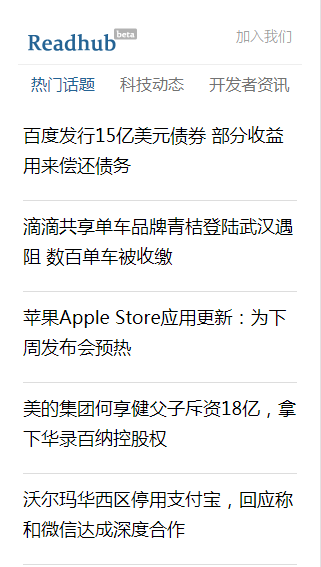

# readhub

> A Vue.js project

<p align="center">
Awesome douban DEMO created with Vue2.x  + Vue-router + axios
</p>

<p align="center">
    
    <br><br>
    <br>
	 <strong><a href="https://xiaomingli.github.io/hexo/views/other/readhub/">Live Demo</a></strong>
</p>

## Build Setup

``` bash
# install dependencies
npm install

# serve with hot reload at localhost:8080
npm run dev

# build for production with minification
npm run build

# build for production and view the bundle analyzer report
npm run build --report
```

For a detailed explanation on how things work, check out the [guide](http://vuejs-templates.github.io/webpack/) and [docs for vue-loader](http://vuejs.github.io/vue-loader).
